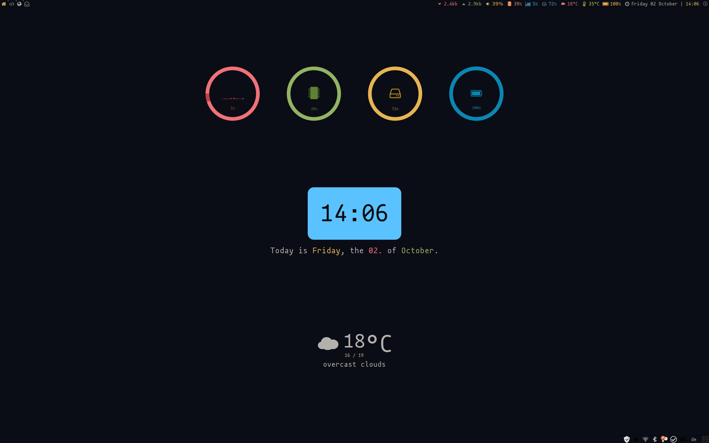
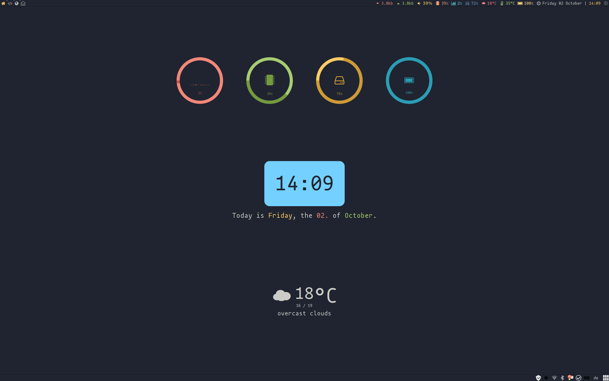
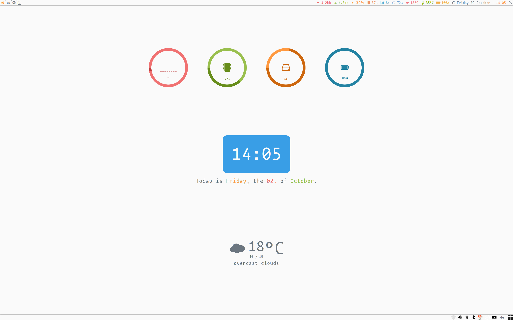

> [ayu][] is a simple theme with bright colors and comes in three versions — dark, mirage and light for all day long comfortable work.

This is a modified version of the multicolor theme from [Awesome WM Copycats][awesome-copycats] using the gorgeous [ayu color palette][ayu-colors].

# Screenshoots

### dark



---

### mirage



---

### light




# Installation

## Dependencies

 * [lain][lain]
 * [owfont - symbol font for Open Weather Map API][owfont]
 * [Font Awesome 4][FontAwesome4]
 * [mononoki][mononoki]

## Quick installation example

 1. Clone [lain][lain] and theme to `~/.config/awesome/`
    ```shell
    cd .config/awesome
    mkdir themes
    git clone https://github.com/MArpogaus/awesome-ayu.git themes/ayu
    git clone https://github.com/lcpz/lain.git lain
    ```

 1. Install [Font Awesome 4][FontAwesome4] and [mononoki][mononoki]
    ```shell
    # Debian / Ubuntu
    apt install fonts-font-awesome fonts-mononoki
    # Manjaro
    pamac build ttf-font-awesome-4 ttf-mononoki
    ```
 
 1. Download and install [owfont][owfont]
    ```shell
    wget -O /usr/share/fonts/TTF/owfont-regular.ttf 'https://github.com/websygen/owfont/blob/master/fonts/owfont-regular.ttf?raw=true'
    ```

 1. Create your config.lua to set Your City Id (For more info see https://github.com/lcpz/awesome-copycats#notes)
    ```shell
    cp themes/ayu/config.lua.template config.lua
    ```
 
 1. Load the theme in your `rc.lua`
    ```shell
    local chosen_theme= "ayu"
    beautiful.init(string.format("%s/.config/awesome/themes/%s/theme.lua", os.getenv("HOME"), chosen_theme))
    awful.screen.connect_for_each_screen(beautiful.at_screen_connect)
    ```

 1. install [wpgtk][wpgtk] to switch color schemes. (optional)
    [JSON colorschemes][JsonColorschemes] can be found in the `wpg` folder.

# Helper functions

You can use the following functions to dynamically change the used color scheme:

```lua
local set_dark = function() 
    local theme = beautiful.get()
    theme:set_dark()
    -- update awesome colorscheme 
    awful.screen.connect_for_each_screen(beautiful.at_screen_connect)
    -- update gtk/rofi colorscheme
    wpg("dark")
    -- update sublime colorscheme
    subl("dark")
end
local set_mirage = function() 
    local theme = beautiful.get()
    theme:set_mirage()
    -- update awesome colorscheme 
    awful.screen.connect_for_each_screen(beautiful.at_screen_connect)
    -- update gtk/rofi colorscheme
    wpg("mirage")
    -- update sublime colorscheme
    subl("mirage")
end
local set_light = function() 
    local theme = beautiful.get()
    theme:set_light()
    -- update awesome colorscheme 
    awful.screen.connect_for_each_screen(beautiful.at_screen_connect)
    -- update gtk/rofi colorscheme
    wpg("light")
    -- update sublime colorscheme
    subl("light")
end
```

**Note:** Using `awful.screen.connect_for_each_screen(beautiful.at_screen_connect)` to update colors inside awesome, seams to cause significant performance issues when heavily used. Probably because old resources aren't freed properly. if you know a better way please let me know :)

I use the following function to switch colorschemes using wpgtk.
```lua
local function wpg( theme )
  awful.spawn.with_shell(string.format("wpg -s %s.png", theme))
end
```

To update the colorscheme in sublime text accordingly, this function can be used.
```lua
local function subl( theme )
  local subl_prefs = string.format("%s/.config/sublime-text-3/Packages/User/Preferences.sublime-settings", os.getenv("HOME"))
  awful.spawn.with_shell(string.format("sed -i 's:ayu-\\(light\\|dark\\|mirage\\):ayu-%s:' '%s'", theme, subl_prefs))
end
```

# Related projects and ports

- `ayu` for Ace: https://github.com/ayu-theme/ayu-ace
- `ayu` colors as NPM package: https://github.com/ayu-theme/ayu-colors
- `ayu` for VSCode: https://github.com/teabyii/vscode-ayu
- `ayu` for XCode: https://github.com/vburojevic/ayu-xcode-theme
- `ayu` for Sublime Text 3: https://github.com/dempfi/ayu

[ayu]: https://github.com/dempfi/ayu/blob/master/README.md
[awesome-copycats]: https://github.com/lcpz/awesome-copycats
[ayu-colors]: https://github.com/ayu-theme/ayu-colors
[lain]: https://github.com/lcpz/lain
[owfont]: http://websygen.github.io/owfont/
[FontAwesome4]: https://github.com/FortAwesome/Font-Awesome
[mononoki]: https://madmalik.github.io/mononoki/
[wpgtk]: https://github.com/deviantfero/wpgtk
[JsonColorschemes]: https://github.com/deviantfero/wpgtk/wiki/Colorschemes#import-a-colorscheme
