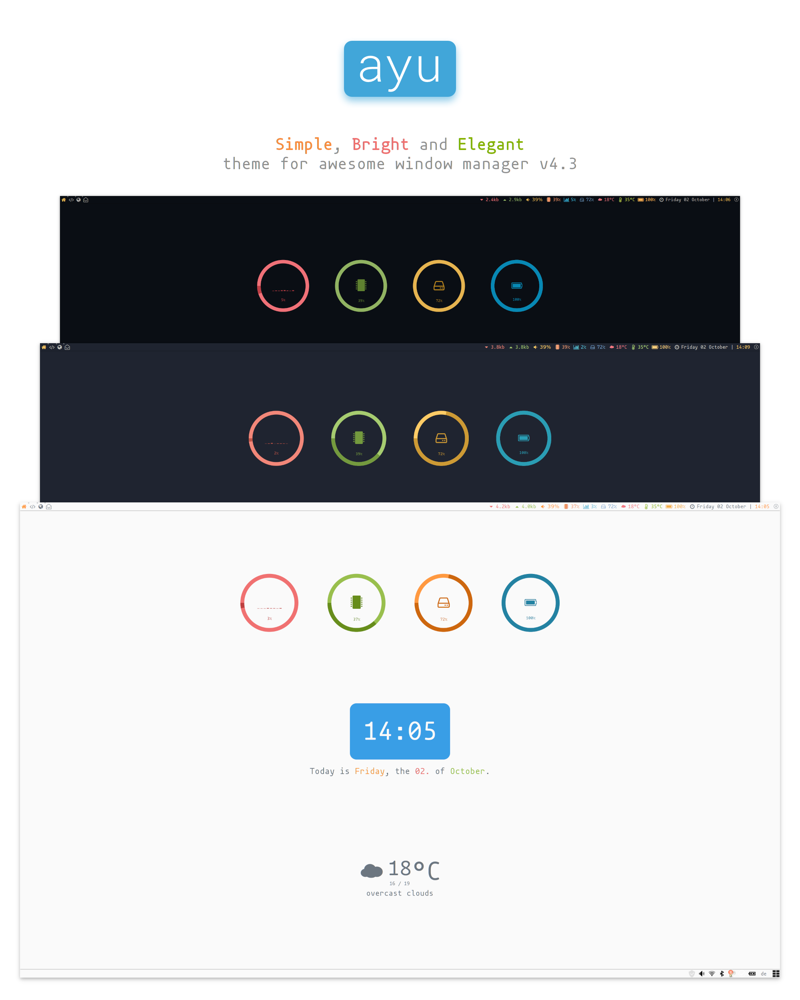

> [ayu][] is a simple theme with bright colors and comes in three versions — dark, mirage and light for all day long comfortable work.

This is a modified version of the multicolor theme from [Awesome WM Copycats][awesome-copycats] using the gorgeous [ayu color palette][ayu-colors].

# Screenshoots

### dark


---

### mirage


---

### light


# Installation

## Dependecies

 * [lain][lain]
 * [owfont - symbol font for Open Weather Map API][owfont]
 * [Font Awesome 4][FontAwesome4]

## Quick installation example

 1. Install [Awesome WM Copycats][awesome-copycats]
    ```shell
    git clone --recursive https://github.com/lcpz/awesome-copycats.git ~/.config/awesome
    ```

 2. Install [Font Awesome 4][FontAwesome4]
    ```shell
    apt install fonts-font-awesome
    ```
 
 3. Download and install [owfont][owfont]

 4. Clone this repo to `~/.config/awesome/themes`
    ```shell
    git clone https://github.com/MArpogaus/awesome-ayu.git ~/.config/awesome/themes/ayu
    ```

 5. Set Your City Id in `themes.ayu.config`. For more info see https://github.com/lcpz/awesome-copycats#notes

# Usage

To activate the theme set `chosen_theme = "ayu"` in `~/.config/rc.lua`.

You can use the following functions to dynamically change the used color scheme:

```lua
local set_dark = function() 
    local theme = beautiful.get()
    theme:set_dark()
    awful.screen.connect_for_each_screen(function(s) beautiful.at_screen_connect(s) end)
end
local set_mirage = function() 
    local theme = beautiful.get()
    theme:set_mirage()
    awful.screen.connect_for_each_screen(function(s) beautiful.at_screen_connect(s) end)
end
local set_light = function() 
    local theme = beautiful.get()
    theme:set_light()
    awful.screen.connect_for_each_screen(function(s) beautiful.at_screen_connect(s) end)
end
```
# Related projects and ports

- `ayu` for Ace: https://github.com/ayu-theme/ayu-ace
- `ayu` colors as NPM package: https://github.com/ayu-theme/ayu-colors
- `ayu` for VSCode: https://github.com/teabyii/vscode-ayu
- `ayu` for XCode: https://github.com/vburojevic/ayu-xcode-theme
- `ayu` for Sublime Text 3: https://github.com/dempfi/ayu

[awesome-copycats]: https://github.com/lcpz/awesome-copycats
[ayu-colors]: https://github.com/ayu-theme/ayu-colors
[ayu]: https://github.com/dempfi/ayu/blob/master/README.md
[FontAwesome4]: https://github.com/FortAwesome/Font-Awesome
[owfont]: http://websygen.github.io/owfont/
[lain]: https://github.com/lcpz/lain
